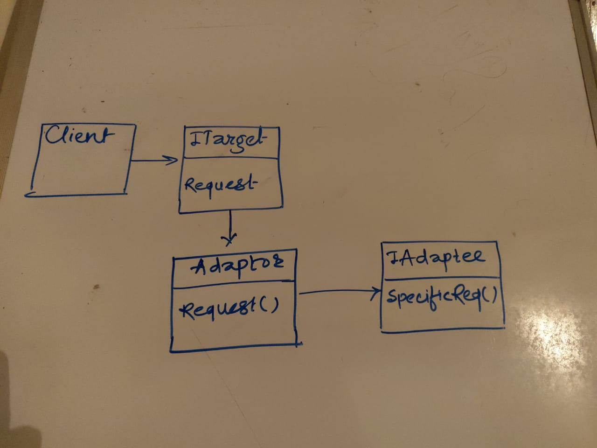
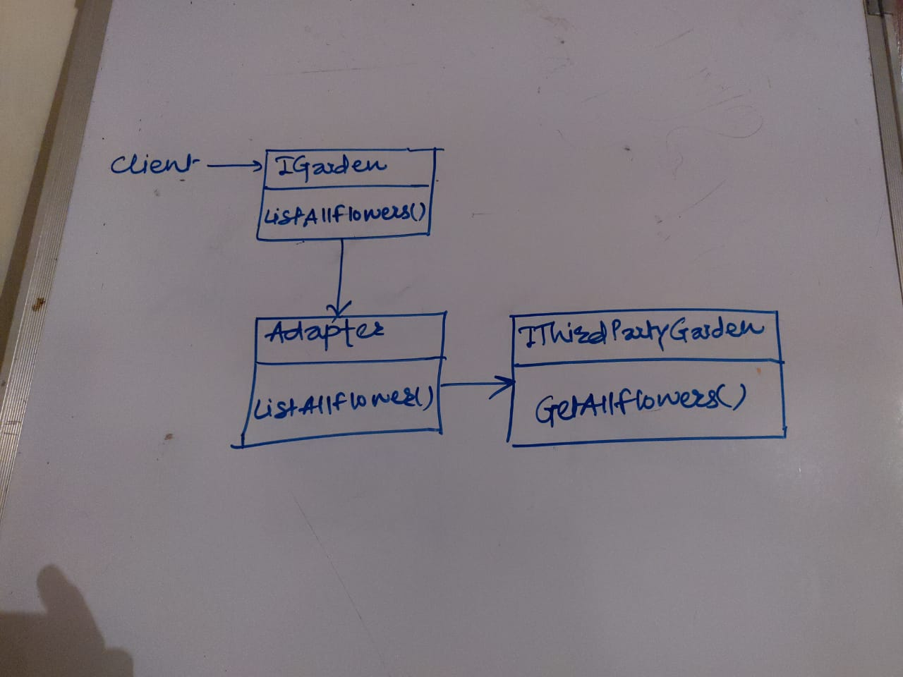

There are four patterns which gets easily mixed with each other
1. Adaptor
2. Facade
3. Proxy
4. Decorator

Lets quickly talk about the differences,
1. Adaptor pattern is about the 2 interfaces, which arent compatible, compatible.
2. Facade pattern is about, taking a bunch of complex interactions and creating a facade to use, instead of dealing with all those complex.
3. Proxy is a way of placing a proxy between something that we want to call.
4. Decorator is adding behaviour to a particular object, without actually opening it.

Intent: 
An adapter lets classes work together that could not otherwise because of incompatible interfaces.

When to Use Adapter:
We should use the Adapter class whenever we want to work with the existing class but its interface is not compatible with the rest of our code. 
Basically, the Adapter pattern is a middle-layer which serves as a translator between the code implemented in our project and some third party class or any other class with a different interface.

UML Diagram:

