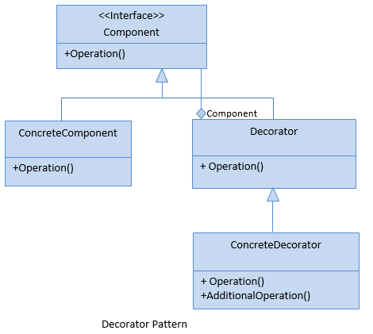

Definition :
A Decorator is a structural design pattern that allows us to extend the behavior of objects by placing these objects into a special wrapper class. 
The Decorator design pattern is quite popular in C# due to the fact that it helps us dynamically add behaviors to the wrapped objects.

So, when do we use this pattern?

Well, we should use this pattern when we have a need to add additional behavior to our objects.

UML Diagram:
